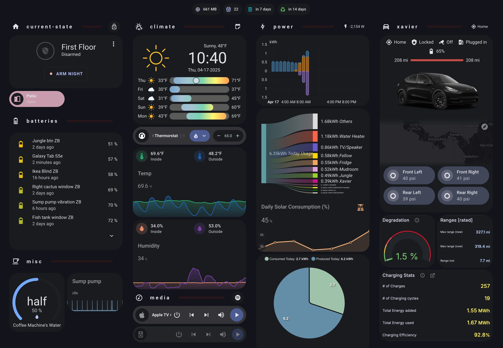

# The Core Hub: System Brain

This section covers the main software that runs your automations locally without needing the internet.

### Featured Resource: Home Assistant Core Documentation
* **URL:** [https://www.home-assistant.io/docs/](https://www.home-assistant.io/docs/)
* **Definition, Purpose, and Scope:** Home Assistant is an open-source OS that acts as the brain for your smart home. The core documentation is the manual for setting up the server and connecting devices without using cloud servers. The scope covers the main installation, system config, and the official integrations database.
* **Value and Instruction:** This is the most important piece because it ties all your other tools (like MQTT and Zigbee) together into one interface. Start with the "Installation" guide for your specific hardware (like a Raspberry Pi). *Tip:* Always check the "Integrations" page here before buying a new smart device to make sure it actually supports local control.

### Example Home Assistant Dashboard

<footer>
  

    <a href="index.html">← Return to Home</a>
    <a href="protocols.html">Next: Protocol Registry →</a>
  

</footer>
